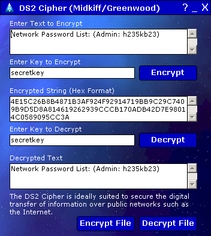

## DS2 Encryption Professionally Developed Stream Cipher

### Description

DS2 is a professionally developed symmetric stream cipher encryption algorithm.  It supports undeterminably large variable-length keys using two sboxes and was specifically designed for the Visual Basic environment but due to its success the DS2 is being ported to all platforms/languages. Provided in an Easy to use Class Module.

Many Thanks to David Midkiff for his contributions & support to the project.
 
### More Info
 
Know How to use a class module.

             |
---                |---
**Submitted On**   |2001-12-29 03:00:36
**By**             |[Dave Greenwood](https://github.com/Planet-Source-Code/PSCIndex/blob/master/ByAuthor/dave-greenwood.md)
**Level**          |Intermediate
**User Rating**    |5.0 (25 globes from 5 users)
**Compatibility**  |VB 5\.0, VB 6\.0
**Category**       |[Encryption](https://github.com/Planet-Source-Code/PSCIndex/blob/master/ByCategory/encryption__1-48.md)
**World**          |[Visual Basic](https://github.com/Planet-Source-Code/PSCIndex/blob/master/ByWorld/visual-basic.md)
**Archive File**   |[DS2\_Encryp982226242002\.zip](https://github.com/Planet-Source-Code/dave-greenwood-ds2-encryption-professionally-developed-stream-cipher__1-36216/archive/master.zip)

